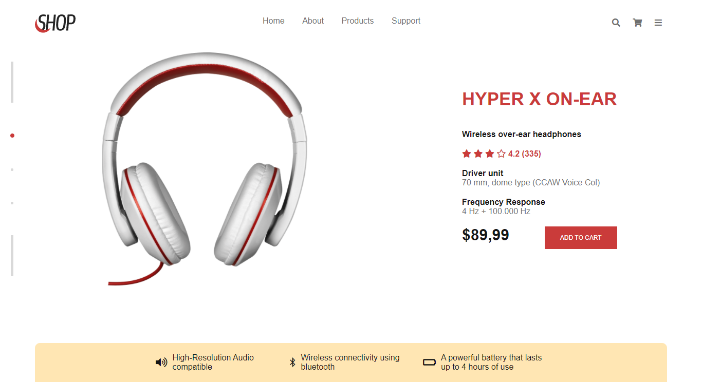
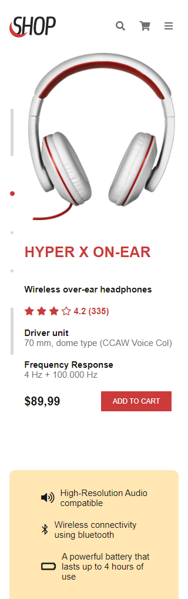

# Descrição do projeto
- Desafio sugerido pelo site <a href="https://www.devchallenge.com.br/">DevChallenge</a> para criar uma landing page para venda de um fone de ouvido.
- Utilizei apenas flexbox no css, mas percebi que teria sido melhor utilizar grid também

## Layout sugerido no desafio

  
  

## Resultado que alcancei

  
  

# Links
Repositório do desafio <a href="https://github.com/devchallenge-io/fone-landing-page">Fone landing page</a> 
Desafio criado por  <a href="https://www.linkedin.com/in/emmanuel-messias-535621127/">Emmanuel Messias</a>
